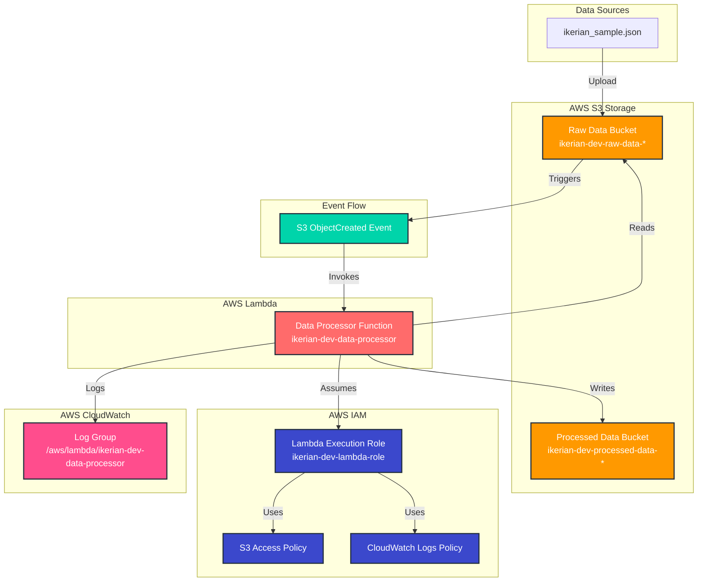

# Architecture Diagram

## AWS Data Pipeline Architecture



## Detailed Component Description

### 1. Data Ingestion Layer
- **Source File**: `files/s3/ikerian_sample.json` - Sample data in JSON format
- **Storage**: Raw Data stored in raw_data s3 Bucket with versioning and encryption enabled

### 2. Processing Layer
- **Trigger Event**: S3 ObjectCreated event triggered for a .json files upload into the raw data bucket
- **Function**: AWS Lambda with Python 3.9 as the runtime
- **Processing**: Extracts `patient_id` and `patient_name` fields from data

### 3. Storage Layer
- **Raw Storage**: S3 bucket for incoming data
- **Processed Storage**: S3 bucket for processed results
- **Security**: Server-side encryption, public access blocked

### 4. Security Layer
- **IAM Role**: Lambda execution role with minimal required permissions
- **Policies**: S3 read/write and CloudWatch logging permissions
- **Principle**: Least privilege access

### 5. Monitoring Layer
- **Logging**: CloudWatch Logs with 14-day retention
- **Observability**: Structured logging for debugging and monitoring

## Data Flow Sequence

1. **Upload**: JSON file uploaded to raw data bucket
2. **Trigger**: S3 ObjectCreated event fires
3. **Invoke**: Lambda function triggered automatically
4. **Read**: Lambda reads JSON data from raw bucket
5. **Process**: Extract required fields (patient_id, patient_name)
6. **Write**: Processed data written to processed bucket with timestamp
7. **Log**: All operations logged to CloudWatch

## Security Architecture

```
┌────────────────────────────────────────────────────────────┐
│                    AWS Account Boundary                    | 
├────────────────────────────────────────────────────────────|
│  ┌─────────────┐    ┌─────────────┐    ┌─────────────┐     │
│  │   S3 Raw    │    │   S3 Proc   │    │   Lambda    │     │
│  │   Bucket    │    │   Bucket    │    │  Function   │     │
│  │             │    │             │    │             │     │
│  │ • Encrypted │    │ • Encrypted │    │ • IAM Role  │     │
│  │ • Private   │    │ • Private   │    │ • VPC None  │     │
│  │ • Versioned │    │ • Versioned │    │ • Timeout   │     │
│  └─────────────┘    └─────────────┘    └─────────────┘     │
│           │                 │                 │            │
│           └─────────────────┼─────────────────┘            │
│                             │                              │
│  ┌─────────────┐    ┌─────────────┐    ┌─────────────┐     │
│  │    IAM      │    │ CloudWatch  │    │   S3 Event  │     │
│  │   Role      │    │    Logs     │    │ Notification│     │
│  │             │    │             │    │             │     │
│  │ • S3 Access │    │ • 14-day    │    │ • JSON Only │     │
│  │ • Logging   │    │ • Retention │    │ • Auto      │     │
│  │ • Minimal   │    │ • Structured│    │ • Trigger   │     │
│  └─────────────┘    └─────────────┘    └─────────────┘     │
└────────────────────────────────────────────────────────────┘
```

## Scalability Considerations

- **Concurrent Processing**: Multiple files can be processed simultaneously
- **Auto-scaling**: Lambda automatically scales based on demand
- **Storage**: S3 provides unlimited storage with lifecycle policies
- **Performance**: Lambda timeout and memory configurable per requirements
